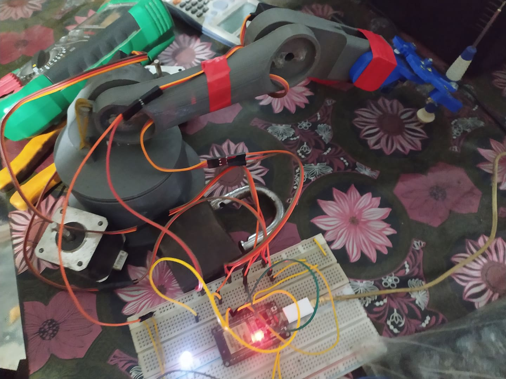
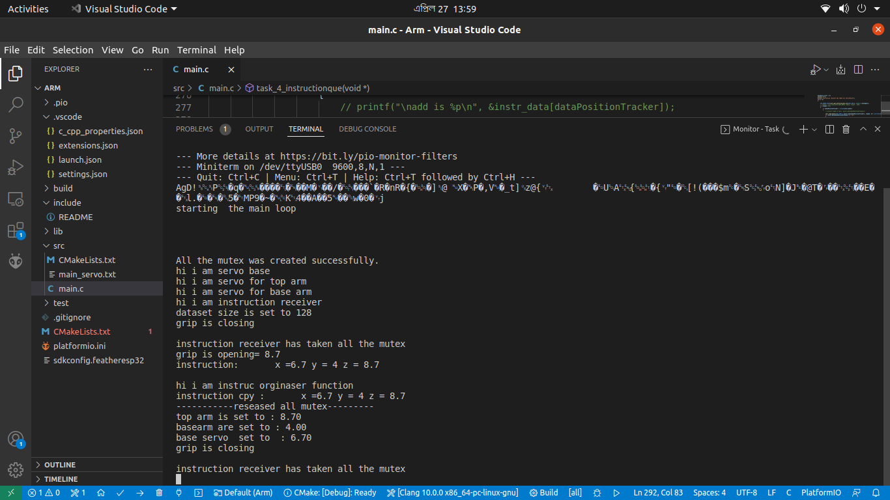

# ARM
A repo contains code to operate 4 servo and 1 stepper motor controlled arm by listing to uart port using esp_IDF and freeRTOS  multithreading tasks.

Here we can see an example how to use the UART to send command to the servos of the arm

